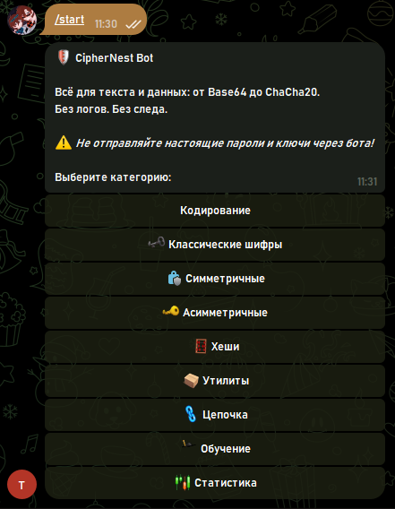
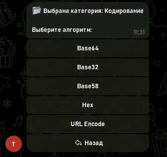
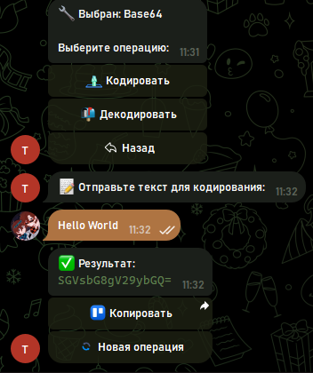
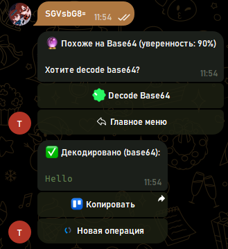
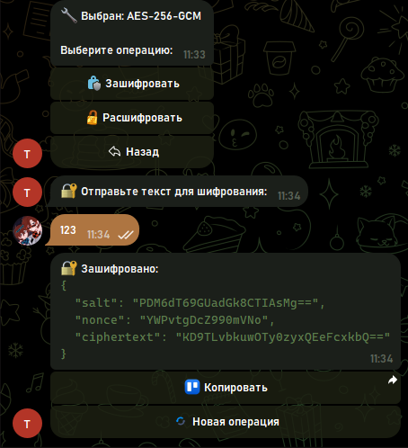
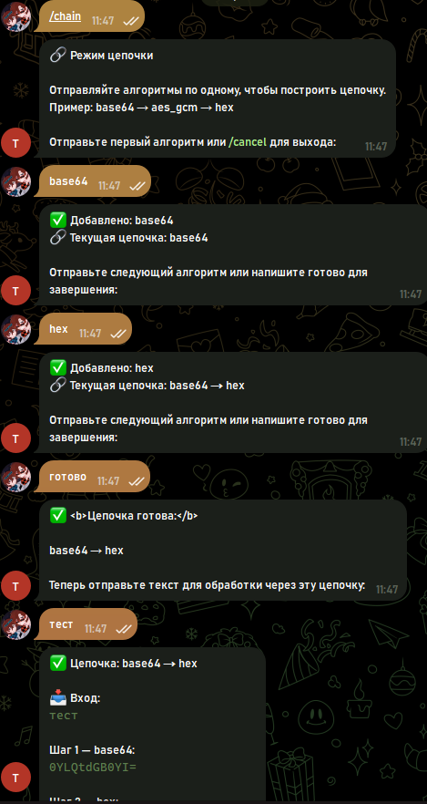
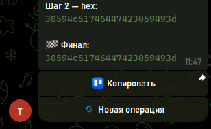

# CipherNest — Telegram Crypto Bot

<p align="center">
  
  
  
  
  
</p>

<p align="center">
  <strong>🛡️ Всё для текста и данных: от Base64 до ChaCha20</strong><br>
  <em>Без логов. Без следа. Образование и практика.</em>
</p>

---

## 📋 Оглавление

- [О проекте](#-о-проекте)
- [Возможности](#-возможности)
- [Скриншоты](#-скриншоты)
- [Быстрый старт](#-быстрый-старт)
- [Docker](#-docker)
- [Команды бота](#-команды-бота)
- [Алгоритмы](#-алгоритмы)
- [Безопасность](#-безопасность)
- [Архитектура](#-архитектура)
- [Тесты](#-тесты)
- [Contributing](#-contributing)
- [License](#-license)

---

## 📖 О проекте

**CipherNest** — это Telegram-бот для выполнения криптографических операций и кодирования данных. Бот поддерживает более **25 алгоритмов** — от простых кодировок до современного шифрования.

**Идеально подходит для:**
- 🎓 Изучения криптографии на практике
- 🔧 Быстрой проверки и кодирования данных
- 🛠️ Генерации ключей и UUID для разработки
- 🔍 Автоматического определения форматов данных

> ⚠️ **Важно:** Бот создан для образовательных целей. Не отправляйте реальные пароли, приватные ключи или конфиденциальные данные.

---

## ✨ Возможности

| Категория | Что включено |
|-----------|--------------|
| 🔤 **Кодирование** | Base64, Base32, Base58, Hex, URL Encode |
| 🗝️ **Классические шифры** | ROT13, ROT47, Цезарь, Атбаш, Код Морзе |
| 🔐 **Симметричное шифрование** | AES-256-GCM, ChaCha20-Poly1305 |
| 🔑 **Асимметричное шифрование** | RSA-2048 (ключи + подпись), Ed25519 (ключи + подпись) |
| 🧮 **Хеши** | MD5, SHA-1/256/512, SHA3-256, BLAKE2b, Argon2id, CRC32 |
| 📦 **Утилиты** | ZLIB сжатие, UUID v4, JWT Decode |
| 🔗 **Режим цепочки** | Последовательное применение нескольких преобразований |
| 🔍 **Автодетект** | Автоматическое определение формата входных данных |
| 🎓 **Обучение** | Подробная информация о каждом алгоритме |

---

## 📸 Скриншоты

<p align="center">
  
  
</p>
<p align="center">
  
  
</p>
<p align="center">
  
  
</p>
<p align="center">
  
</p>

---

## 🚀 Быстрый старт

### 1. Установка зависимостей

```bash
pip install -r requirements.txt
```

### 2. Получение токена бота

1. Откройте **@BotFather** в Telegram
2. Отправьте команду `/newbot`
3. Следуйте инструкциям для создания бота
4. Скопируйте токен (выглядит как: `123456789:ABCdefGHIjklMNOpqrsTUVwxyz`)

### 3. Настройка

```bash
# Скопируйте шаблон конфигурации
cp .env.example .env

# Откройте .env и вставьте ваш токен
# Windows:
notepad .env
# Linux/Mac:
nano .env
```

**Содержимое `.env`:**
```env
# Токен Telegram-бота (обязательно, получить у @BotFather)
BOT_TOKEN=ваш_токен_здесь

# Уровень логирования (INFO, DEBUG, WARNING, ERROR)
LOG_LEVEL=INFO
```

### 4. Запуск

```bash
python main.py
```

Вы должны увидеть:
```
2026-04-03 12:00:00 - root - INFO - CipherNest Bot starting...
2026-04-03 12:00:01 - aiogram.dispatcher - INFO - Start polling
```

Бот работает! Откройте его в Telegram и отправьте `/start`.

---

## 🐳 Docker

### Docker Compose (рекомендуется)

```bash
docker-compose up -d
```

### Ручная сборка

```bash
docker build -t ciphernest .
docker run -d --env-file .env --name ciphernest-bot ciphernest

# Просмотр логов
docker logs -f ciphernest-bot
```

---

## 📱 Команды бота

| Команда | Описание |
|---------|----------|
| `/start` | Главное меню с категориями алгоритмов |
| `/help` | Инструкция по использованию |
| `/chain` | Режим цепочки (несколько преобразований подряд) |
| `/cancel` | Отмена текущей операции |

---

## 📊 Алгоритмы

### 🔤 Кодирование

| Алгоритм | Кодировать | Декодировать | Описание |
|----------|:----------:|:------------:|----------|
| **Base64** | ✅ | ✅ | Стандартная кодировка для бинарных данных в текст |
| **Base32** | ✅ | ✅ | Кодировка для систем без поддержки нижнего регистра |
| **Base58** | ✅ | ✅ | Кодировка Bitcoin (без неоднозначных символов) |
| **Hex** | ✅ | ✅ | Шестнадцатеричное представление байт |
| **URL Encode** | ✅ | ✅ | Безопасная кодировка для URL-адресов |

### 🗝️ Классические шифры (только для обучения)

| Алгоритм | Описание |
|----------|----------|
| **ROT13** | Сдвиг на 13 позиций (симметричный) |
| **ROT47** | Сдвиг на 47 позиций в ASCII-диапазоне |
| **Цезарь** | Сдвиг алфавита на N позиций |
| **Атбаш** | Зеркальная замена букв алфавита |
| **Код Морзе** | Текст → азбука Морзе и обратно |

> ⚠️ Классические шифры **не обеспечивают безопасность**. Используйте только для изучения принципов криптографии.

### 🔐 Симметричное шифрование

| Алгоритм | Ключ | Описание |
|----------|------|----------|
| **AES-256-GCM** | Пароль | Современный стандарт шифрования (256 бит, GCM режим) |
| **ChaCha20-Poly1305** | Пароль | Высокоскоростной потоковый шифр с аутентификацией |

### 🔑 Асимметричное шифрование

| Алгоритм | Возможности | Описание |
|----------|-------------|----------|
| **RSA-2048** | Генерация ключей, Подпись, Проверка | Классический алгоритм с открытым ключом |
| **Ed25519** | Генерация ключей, Подпись, Проверка | Современная схема подписи на эллиптических кривых |

### 🧮 Хеши

| Алгоритм | Статус | Описание |
|----------|--------|----------|
| **MD5** | 🔓 Устарел | Только для обучения. Не использовать для безопасности |
| **SHA-1** | 🔓 Устарел | Только для обучения. Не использовать для безопасности |
| **SHA-256** | ✅ Актуален | Стандартный криптографический хеш |
| **SHA-512** | ✅ Актуален | Увеличенная версия SHA-2 |
| **SHA3-256** | ✅ Актуален | Современный стандарт на основе Keccak |
| **BLAKE2b** | ✅ Актуален | Высокоскоростной хеш-алгоритм |
| **Argon2id** | ✅ Актуален | Рекомендован для хеширования паролей |
| **CRC32** | ✅ Контрольная сумма | Для обнаружения случайных ошибок, не криптографический |

### 📦 Утилиты

| Утилита | Описание |
|---------|----------|
| **ZLIB** | Сжатие и распаковка данных |
| **UUID v4** | Генерация уникальных идентификаторов |
| **JWT Decode** | Декодирование JSON Web Token (без верификации) |

---

## 🛡️ Безопасность

> 🐛 **Нашли уязвимость или баг?**  
> Пожалуйста, ознакомьтесь с **[политикой безопасности →](SECURITY.md)**.  
> Мы принимаем ответственные сообщения об уязвимостях и гарантируем ответ в течение **48 часов**.  
> 📧 `ciphernest.security@internet.ru`

---

### ✅ Что реализовано

| Мера | Описание |
|------|----------|
| **Stateless-обработка** | Данные хранятся только в RAM и удаляются сразу после ответа |
| **Rate Limiting** | 10 запросов в 60 секунд на одного пользователя |
| **Без логов** | Входные данные не сохраняются на диск |
| **Предупреждения** | Классические шифры и MD5/SHA-1 помечены как небезопасные |

### ⚠️ Рекомендации

| ✅ Делайте | ❌ Не делайте |
|------------|---------------|
| Используйте для изучения и тестирования | Не отправляйте реальные пароли и ключи |
| Генерируйте примеры ключей для разработки | Не используйте ROT13/Цезарь для защиты данных |
| Тестируйте алгоритмы перед внедрением в код | Не используйте MD5/SHA-1 в production |

### 🔒 Для production-развёртывания

1. Используйте **Redis** вместо `MemoryStorage` для распределённых сессий
2. Настройте **reverse proxy** (nginx) для защиты от DDoS
3. Обновите зависимости: `pip install --upgrade -r requirements.txt`
4. Разверните на VPS с фаерволом и SSL-сертификатами

---

## 🏗️ Архитектура

```
CipherNest/
├── main.py                     # Точка входа, инициализация бота
├── app/
│   ├── __init__.py             # Инициализация пакета
│   ├── bot_handlers.py         # Обработчики команд и callback'ов
│   ├── crypto_engine.py        # Ядро криптографических операций
│   ├── chain_processor.py      # Обработка цепочек преобразований
│   ├── security.py             # Rate limiting и валидация
│   ├── education.py            # Информация об алгоритмах
│   ├── premium_emoji.py        # Настройка кастомных emoji
│   └── ...
├── tests/                      # Модульные тесты (44 теста)
├── requirements.txt            # Python-зависимости
├── Dockerfile                  # Конфигурация Docker
├── docker-compose.yml          # Docker Compose
├── .env.example                # Шаблон переменных окружения
└── README.md                   # Документация
```

---

## 🧪 Тесты

```bash
python -m unittest discover -s tests -v
```

Ожидается: **44 теста проходят успешно**

---

## 🌐 Деплой

### Платформы для бесплатного хостинга

| Платформа | Инструкция |
|-----------|------------|
| **Railway** | Подключите репозиторий, добавьте `BOT_TOKEN` в переменные среды |
| **Render** | Создайте Web Service, укажите `python main.py` как команду запуска |
| **Fly.io** | `fly launch` → настройте `BOT_TOKEN` в секретах |
| **VPS** | Ubuntu/Debian сервер, systemd service + nginx reverse proxy |

### Переменные окружения

| Переменная | Обязательная | По умолчанию | Описание |
|------------|:------------:|:------------:|----------|
| `BOT_TOKEN` | ✅ | — | Токен бота от @BotFather |
| `LOG_LEVEL` | ❌ | `INFO` | Уровень логирования |

---

## 🤝 Contributing

Вклад в проект приветствуется!

1. Форкните репозиторий
2. Создайте ветку для новой функциональности (`git checkout -b feature/amazing-feature`)
3. Зафиксируйте изменения (`git commit -m 'Add amazing feature'`)
4. Отправьте в ветку (`git push origin feature/amazing-feature`)
5. Откройте Pull Request

---

## 📄 License

Этот проект распространяется под лицензией **MIT**. Подробности в файле `LICENSE`.

---

## 🙏 Благодарности

- [aiogram 3](https://docs.aiogram.dev/) — Telegram Bot Framework
- [cryptography](https://cryptography.io/) — Криптографическая библиотека
- [argon2-cffi](https://argon2-cffi.readthedocs.io/) — Хеширование паролей

---

<p align="center">
  <strong>CipherNest</strong> — изучайте криптографию на практике 🔐
</p>
